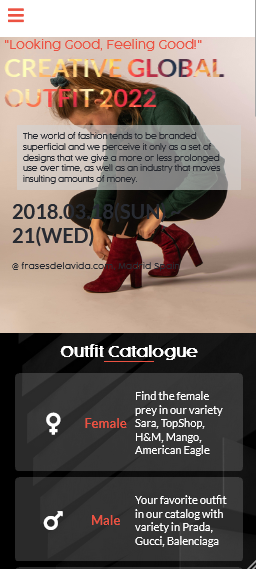
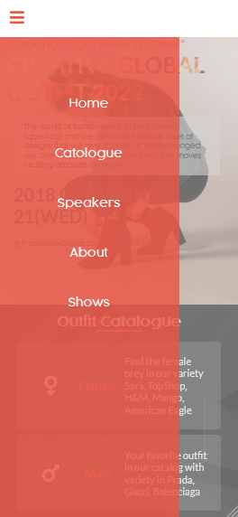
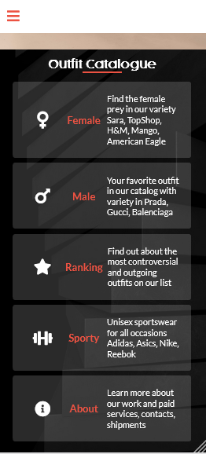
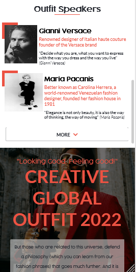
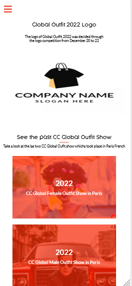

# Capstone Project

>This is the final project of the first module "The Portal"

### Capstone Project Topic

> The topic for this capstone project focused on creating based on the design shared by [Cindy Shin](https://www.behance.net/adagio07), a page related to the best outfits and garments among the most recognized brands in the world. 

## Built with
* HTML - CSS
* GIT/GITHUB
* Cindy Shin behance guideline
* FLEXBOX
* CSS Query

## Project Screenshot

### Mobile Version

1. **Home Section**

2. **Mobile Menu**

3. **Main Feature**

4. **Speakers Feature**

5. **About Section**

### Desktop Version

1. **Opening Page**

## Live Page
-check my web-page: [Capstone-Project](https://nicolaswg.github.io/Nicolas_Microverse_Portfolio/)

## Authors

👤 **Cindy Shin**
> Look and **Cindy Info** [Here](https://www.behance.net/adagio07/info)

👤 **Nicolas Gonzalez**

-Github: [Github](https://github.com/Nicolaswg)
-LinkedIn: [LinkedIn](https://www.linkedin.com/in/nicolas-gonzalez-8623461a0/)
-Twitter: [Twitter](https://twitter.com/Nicolas54146830)

## 🤝 Contributing

Contributions, issues, and feature requests are welcome!

Feel free to check leave recommendation in [issues page](https://github.com/Nicolaswg/Capstone-Project-1/issues)
